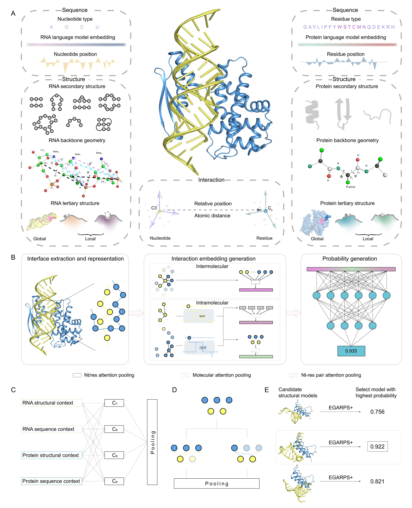

# EGARPS
# Description
EGARPS is a novel tool for evaluating protein-RNA complex structures, which achieves high accuracy by integrating well-designed intermolecular and intramolecular modules with a series of biophysically inspired descriptors. Extensive evaluations illustrated that EGARPS significantly outperformed existing methods on both bound and unbound datasets. Our top 1 success rate was more than twice that of the CNN-based approach. Besides, EGARPS can improve the performance of de novo RNA-protein complex prediction.  
  

# Datasets
EGARPS was evaluated on a bound dataset as well as two widely used protein-RNA docking benchmark datasets. The source data can be downloaded from the following links:  
https://github.com/Zhaolab-GitHub/DRPScore_v1.0/blob/main/DRPScore_4DCNN.zip  
https://zoulab.dalton.missouri.edu/RNAbenchmark/index.htm  
https://life.bsc.es/pid/protein-rna-benchmark/  

# Third-party software needed
Some third-party software has been integrated into the EGARPS pipeline, primarily for structure analysis. DSSP and DSSR are used for identifying the secondary structures of proteins and RNA, respectively, while NACCESS and GHECOM are employed for tertiary structure analysis of proteins and RNA. The download links are provided as follows:  
GHECOM https://pdbj.org/ghecom/  
DSSP https://swift.cmbi.umcn.nl/gv/dssp/DSSP_5.html  
NACCESS http://www.bioinf.manchester.ac.uk/naccess/  
DSSR https://x3dna.org/  
Users need to download and compile the software on their own machines.

# Configuration
**The python environment to run EGARPS can be set up in one of three ways:**  
1. Creating a conda environment from a YAML file  
```
conda env create -f environment.yml
conda activate EGARPS
```
2. Following the instructions below  
```
conda creat --name EGARPS python=3.10
conda activate EGARPS
conda install -c conda-forge -c schrodinger pymol-bundle
conda install conda-forge::pdbfixer
pip install torch==1.12.1+cu116 torchvision==0.13.1+cu116 torchaudio==0.12.1 --extra-index-url https://download.pytorch.org/whl/cu116
conda install dglteam/label/cu116::dgl=1.0.1
pip install atom3 biopandas fair-esm rna-fm
```
We conducted training and testing of EGARPS on Linux with PyTorch 1.12.1 and DGL 1.0.1. Different versions of these libraries may potentially impact the results.  

3. From docker  

**Edit the config file (***scripts/config.json***)**  
Users need to modify and double-check the execution paths of previously compiled third-party software.  

# Usage
### Scoring a specific complex structure
#### Download model weights
Download EGARPS model weights from [this link](https://drive.google.com/file/d/1Fux72Ayp1g_k7yxytfA0ki_WSoxX51Aa/view?usp=drive_link) and unzip it to the ***weights*** folder (seven .pth file in total).  
#### Run EGARPS for prediction
```
cd ./scripts/
python predict.py ../example/complex1.pdb
```
By doing so, EGARPS will evaluate the structure of ***complex1.pdb*** and output the results to ***result.txt***. The first column of the result file contains the ID of the RNA-protein complex, and the second column contains the probability of it being a native structure.  
For users without *NACCESS* and *DSSR* licenses, we offer a reduced version of EGARPS. This version may experience a slight decrease in model performance. Just add the *-non-academic* parameter at runtime:  
```
python predict.py -non-academic ../example/complex1.pdb
```
### Reproducing the results from the manuscript


# Citation
Graph learning-based scoring of RNA-protein complex structures using EGARPS. *Submitted*, 2024.
